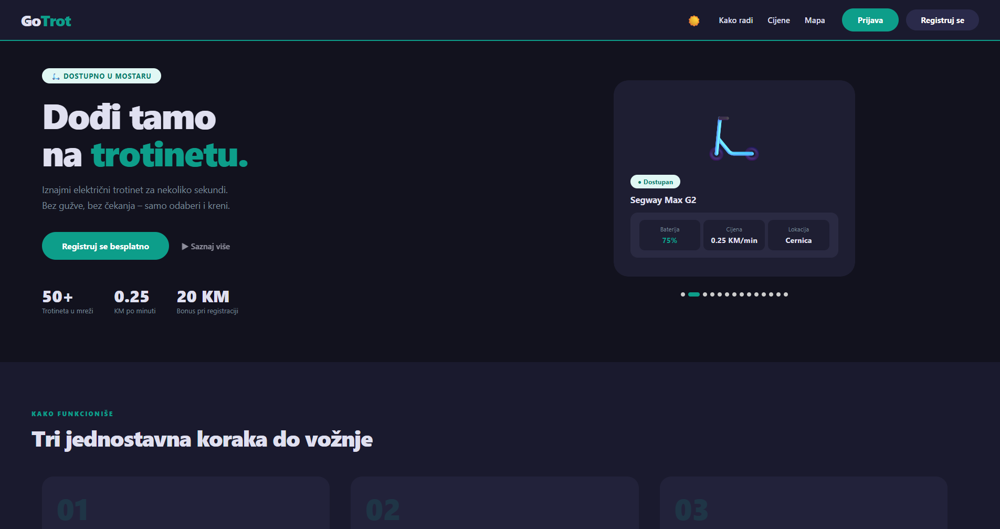

# 🛴 GoTrot — Sistem za iznajmljivanje električnih trotineta

GoTrot je desktop aplikacija za upravljanje sistemom iznajmljivanja električnih trotineta, razvijena u **C# / Windows Forms** sa **SQL Server** bazom podataka. Aplikacija podržava korisničke i admin naloge, praćenje vožnji, rezervacije, upravljanje trotinentima i dark mode.

---

## 📸 Screenshot

> 

---

## 🛠️ Tehnologije

| Tehnologija | Verzija |
|---|---|
| .NET | 6.0 (Windows) |
| Windows Forms | .NET 6 |
| Entity Framework Core | 7.0 |
| SQL Server | 2019+ / LocalDB |
| BCrypt.Net | 4.0.3 |
| Microsoft WebView2 | 1.0.2365.46 |

---

## ✅ Preduslovi

Prije pokretanja projekta potrebno je imati instalirano:

1. **Visual Studio 2022** (Community ili noviji)
   - Workload: `.NET desktop development`
2. **SQL Server** — jedna od opcija:
   - [SQL Server 2019/2022 Express] *(preporučeno)*
   - [SQL Server LocalDB]*(lakša instalacija)*
3. **SQL Server Management Studio (SSMS)** — opcionalno, za pregled baze
4. **.NET 6.0 SDK** — dolazi sa Visual Studio 2022

---

## 🚀 Instalacija i pokretanje

### 1. Kloniranje repozitorija

```bash
git clone https://github.com/Vas_Username/GoTrot.git
cd GoTrot
```

### 2. Konfiguracija baze podataka

Otvori fajl `GoTrot/appsettings.json` i promijeni connection string da odgovara tvom SQL Serveru:

```json
{
  "ConnectionStrings": {
    "DefaultConnection": "Server=IME_VASEG_SERVERA;Database=GoTrotDB;Trusted_Connection=True;TrustServerCertificate=True;MultipleActiveResultSets=True;"
  }
}
```

> ⚠️ **Baza se kreira automatski** — nije potrebno ručno kreirati bazu. Aplikacija sama kreira `GoTrotDB` bazu i sve tabele pri prvom pokretanju.

### 3. Otvaranje projekta

```
GoTrot.sln → otvori u Visual Studio 2022
```

### 4. Restore NuGet paketa

Visual Studio to radi automatski, ili ručno:
```
Tools → NuGet Package Manager → Restore Packages
```

### 5. Pokretanje

Pritisni **F5** ili **Debug → Start Debugging**.

Pri prvom pokretanju aplikacija automatski:
- Kreira bazu `GoTrotDB`
- Kreira sve tabele
- Ubacuje zone Mostara i 23 trotineta kao početne podatke
- Kreira admin nalog

---

## 🔐 Podaci za prijavu

### Admin nalog
| Polje | Vrijednost |
|---|---|
| Email | `admin@gotrot.ba` |
| Lozinka | `admin123` |

### Korisnik
Registruj novi nalog kroz aplikaciju — novi korisnici dobijaju **20.00 KM** bonus kredita.

---

## 📋 Funkcionalnosti

### 👤 Korisnik
- Registracija i prijava (BCrypt hashovanje lozinki)
- Pregled dostupnih trotineta na mapi i u listi
- Iznajmljivanje trotineta sa tajmerom i praćenjem cijene
- Rezervacija trotineta (30 min)
- Uplata kredita
- Pregled historije vožnji i uplata s exportom u CSV
- Ocjenjivanje vožnje (1–5 zvjezdica)

### 🔧 Admin
- Upravljanje trotinentima (dodavanje, brisanje, punjenje)
- Historija svih vožnji u sistemu
- Notifikacije (prazna baterija, vožnje, uplate)
- Statistike po trotinetu
- Upravljanje zonama
- Servisiranje trotineta

### 🎨 Ostalo
- **Dark mode** (uključen po defaultu)
- Landing page sa mapom Mostara (WebView2)
- Toast notifikacije
- Offline punjenje baterije (akumulira se dok je app ugašena)

---
